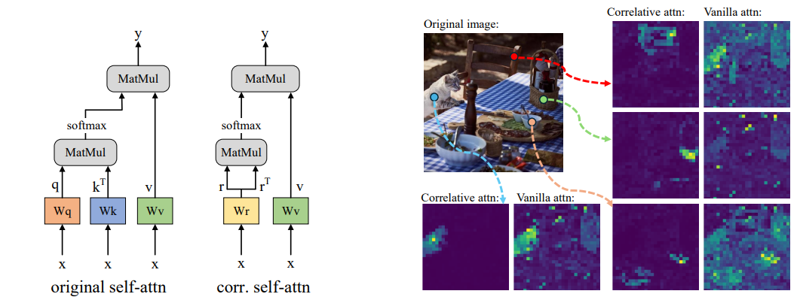

# SCLIP: Rethinking Self-Attention for Dense Vision-Language Inference

**Official PyTorch implementation of SCLIP**

* [SCLIP: Rethinking Self-Attention for Dense Vision-Language Inference](https://arxiv.org/pdf/2312.01597.pdf), Preprint, under review.
* A **simple** but very effective open-vocabulary semantic segmentation model derived from CLIP.
* **SOTA** zero-shot segmentation results obtained by minimal modifications to CLIP's self-attention.

**Model components and our Correlative Self-Attention maps:**



**Open-vocabulary semantic segmentation samples:**


## Dependencies

This repo is built on top of [CLIP](https://github.com/openai/CLIP) and [MMSegmentation](https://github.com/open-mmlab/mmsegmentation). To run SCLIP, please install the following packages with your Pytorch environment. We recommend using Pytorch==1.10.x for better compatibility to the following MMSeg version.

```
pip install openmim
mim install mmcv==2.0.1 mmengine==0.8.4 mmsegmentation==1.1.1
pip install ftfy regex yapf==0.40.1
```


## Datasets
We include the following dataset configurations in this repo: PASCAL VOC, PASCAL Context, Cityscapes, ADE20k, COCO-Stuff10k, and COCO-Stuff164k, with three more variant datasets VOC20, Context59 (i.e., PASCAL VOC and PASCAL Context without the background category), and COCO-Object.

Please follow the [MMSeg data preparation document](https://github.com/open-mmlab/mmsegmentation/blob/main/docs/en/user_guides/2_dataset_prepare.md) to download and pre-process the datasets. The COCO-Object dataset can be converted from COCO-Stuff164k by executing the following command:

```
python datasets/cvt_coco_object.py PATH_TO_COCO_STUFF164K -o PATH_TO_COCO164K
```

**Remember to modify the dataset paths in the config files in** `config/cfg_DATASET.py`


## Run SCLIP
Single-GPU running:

```
python eval.py --config ./config/cfg_DATASET.py --workdir YOUR_WORK_DIR
```

Multi-GPU running:
```
bash ./dist_test.sh ./config/cfg_DATASET.py
```


## Results

The performance of open-vocabulary inference can be affected by the text targets, i.e., the prompts and class names. This repo presents a easy way to explore them: you can modify prompts in `prompts/imagenet_template.py`, and class names in `configs/cls_DATASET.text`. 

The repo automatically loads class names from the `configs/cls_DATASET.text` file. The rule of class names is that each category can have multiple class names, and these class names share one line in the file, separated by commas.

With the default setup in this repo, you should get the following results:

| Dataset               | mIoU  |
| --------------------- | ----- |
| ADE20k                | 16.45 |
| Cityscapes            | 32.34 |
| COCO-Object           | 33.52 |
| COCO-Stuff10k         | 25.91 |
| COCO-Stuff164k        | 22.77 |
| PASCAL Context59      | 34.46 |
| PASCAL Context60      | 31.74 |
| PASCAL VOC (w/o. bg.) | 81.54 |
| PASCAL VOC (w. bg.)   | 59.63 |


## Citation

```
@article{wang2023sclip,
  title={SCLIP: Rethinking Self-Attention for Dense Vision-Language Inference},
  author={Wang, Feng and Mei, Jieru and Yuille, Alan},
  journal={arXiv preprint arXiv:2312.01597},
  year={2023}
}
```
